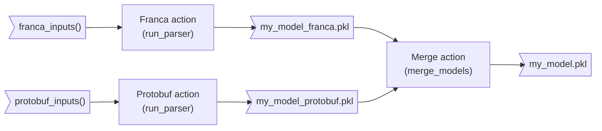
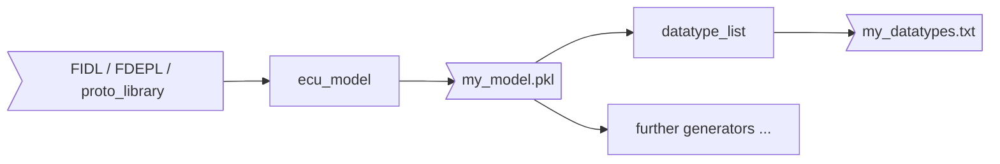

<!----
*******************************************************************************
Copyright (c) 2026 Contributors to the Eclipse Foundation

See the NOTICE file(s) distributed with this work for additional
information regarding copyright ownership.

This program and the accompanying materials are made available under the
terms of the Apache License Version 2.0 which is available at
https://www.apache.org/licenses/LICENSE-2.0

SPDX-License-Identifier: Apache-2.0
*******************************************************************************
-->

# Orchestrator

Builds the ECU model from IDL and other architecture inputs: one Bazel action per parser produces a partial model,
a merge action combines them. Generators and other model-related steps consume the result as separate rules.

Currently orchestrated parsers:

| Parser | Input | Adapter |
| --- | --- | --- |
| [Franca](../parsers/franca_parser) | `.fidl` / `.fdepl` files | [`FrancaAdapter`](parser_adapter.py) |
| [Protobuf](../parsers/protobuf_parser) | `protoc` descriptor sets | [`ProtobufAdapter`](parser_adapter.py) |

## Architecture



`ecu_model` is the public API. It decides from the given inputs which parsers run:

1. Each parser with inputs runs in its own Bazel action, so Bazel parallelizes the parsers and caches every partial
   model on its own: changing an input file of one parser does not re-parse inputs from another parser.
2. A parser action writes its partial model with `ModelRegistry.serialize()`. With inputs for a single parser, this is
   already the model `<name>.pkl` and no merge action runs.
3. With inputs for several parsers, the merge action adds all partial models `<name>_<parser>.pkl` with
   `ModelRegistry.merge_serialized()` and writes `<name>.pkl` with `ModelRegistry.serialize()`. Every serialize call
   runs `finalize()`, which checks model-wide identities (including duplicate datatype names) and fails the action if
   the model is invalid.

The model target provides `EcuModelInfo`, which generators use to receive it.

## Modules

- [`common.py`](common.py): `ParsingPathInfo` and the `Parser` base class of all adapters.
- [`parser_adapter.py`](parser_adapter.py): adapters to the parsers.
- [`run_parser.py`](run_parser.py): command line entry point running one parser.
- [`merge_models.py`](merge_models.py): command line entry point merging models.
- [`ecu_model.bzl`](ecu_model.bzl): the public macro `ecu_model`, the provider `EcuModelInfo` and
  the private per-parser and merge rules.

## Usage

### Bazel

```starlark
load("//score/orchestrator:ecu_model.bzl", "ecu_model", "franca_inputs", "protobuf_inputs")

ecu_model(
    name = "my_model",
    franca = franca_inputs(
        srcs = ["my_service.fdepl"],
        deps = ["my_types.fidl", "//path/to:deployment_specs"],  # only parsed when imported
    ),
    protobuf = protobuf_inputs(
        deps = [":my_proto"],  # proto_library targets, transitive descriptor sets are included
    ),
    log_level = "INFO",  # default WARNING
)
```

The model is written to `my_model.pkl`. Each parser gets its inputs as one argument, created by the matching helper;
omit the argument to skip the parser, e.g. only `protobuf` for a Protobuf model. Load a model with
`ModelRegistry.deserialize()`;
`score.ecu_model.query.datatypes_by_name()` indexes named datatypes by their fully qualified names. See
[`test/BUILD`](test/BUILD) for complete examples.

### Full chain: parse and generate

Generators are not run by the orchestrator. Each generator is a separate Bazel rule consuming the model pickle, so
Bazel caches the parse step and every generator independently and only runs the generators a target needs.



[`datatype_list`](../generators/datatype_list) is a minimal example generator writing one
`<fully qualified name> <kind> <source>` line per datatype:

```starlark
load("//score/generators/datatype_list:datatype_list.bzl", "datatype_list")

datatype_list(
    name = "my_datatypes",
    model = ":my_model",
)
```

```text
example.franca.imported.ImportedTypes.ImportedValue struct franca
example.franca.root.RootTypes.RootValue struct franca
integration.shared.Payload struct protobuf
```

The complete, tested chain is in [`generators/datatype_list/test/BUILD`](../generators/datatype_list/test/BUILD).
A new generator needs a Python executable that loads the model file with `ModelRegistry.deserialize()` and uses
model queries such as `datatypes_by_name()` to access its content, plus a rule taking the model via `EcuModelInfo`. See
[`datatype_list.bzl`](../generators/datatype_list/datatype_list.bzl).

### Command line

The executables behind the Bazel actions, mainly for debugging:

```bash
bazel run //score/orchestrator:run_parser -- --parser franca \
    --src $PWD/my_service.fdepl --dep $PWD/my_types.fidl --output /tmp/franca.pkl --log-level DEBUG
bazel run //score/orchestrator:run_parser -- --parser protobuf \
    --src $PWD/my_proto.pb --output /tmp/protobuf.pkl
bazel run //score/orchestrator:merge_models -- \
    --model /tmp/franca.pkl --model /tmp/protobuf.pkl --output /tmp/model.pkl
```

## Dependency files

Franca only parses dependency files reachable via imports from the source files. Protobuf parses all descriptor sets
together; `ecu_model` passes the transitive descriptor sets of the `protobuf_inputs()` deps.

## Logging

All logging uses the standard `logging` module, configured by the command line entry points via `--log-level` (the
`log_level` argument of `ecu_model`).

- `Parser.run()` logs the start (number of input files, file list on `DEBUG`) and the end (duration, number of created
  model elements) of every parser.
- `merge_models` logs the number of merged model elements and the duration.

## Adding a parser

1. Implement a subclass of `Parser` in [`parser_adapter.py`](parser_adapter.py): set `name` and implement `parse()`,
   which only has to create model elements. They are tracked in `ModelRegistry`.
2. Add the adapter to `PARSERS` in [`run_parser.py`](run_parser.py).
3. Add a private rule for its inputs to [`ecu_model.bzl`](ecu_model.bzl) using `_run_parser()`, a public
   `<parser>_inputs()` helper, and a `<parser>` argument to `ecu_model`, which runs the parser whenever it is
   given.

## Known limitations

- Two Protobuf files with the same import path (e.g. two `consumer.proto` from different `proto_library` targets
  using `strip_import_prefix`) cannot be parsed in one model: `duplicate file name`.
